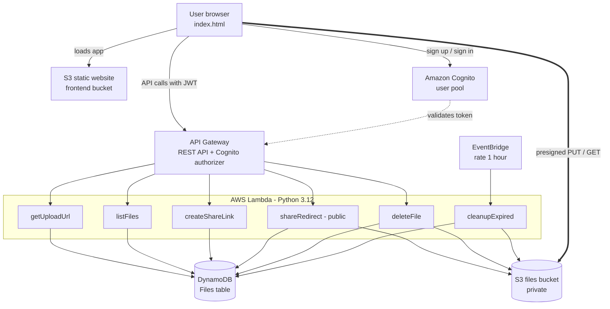

# CloudDrop – Serverless File Sharing with Expiring Links

A cloud computing project built entirely on AWS managed services. Users sign up, upload files, and share download links that stop working after a chosen time (2 minutes, 15 minutes, 1 hour or 24 hours). Expired files are deleted automatically.

---

## 1. Quick start (deploy in about 10 minutes)

### Prerequisites

| Tool | Windows | Linux / macOS |
|---|---|---|
| AWS account | Free Tier account with an IAM user that has AdministratorAccess | same |
| AWS CLI v2 | Download the MSI from aws.amazon.com/cli | `curl` installer from aws.amazon.com/cli, or `brew install awscli` |
| AWS SAM CLI | Download the MSI from the "Installing the AWS SAM CLI" page | `brew install aws-sam-cli` or the Linux zip installer |
| Bash | Git Bash (comes with Git for Windows) or WSL | built in |

Python is **not** needed on your computer. The Lambda code uses only `boto3`, which AWS already provides.

### Steps

```bash
# 1. Configure credentials (region: ap-south-1, output: json)
aws configure

# 2. From the project folder
chmod +x deploy.sh destroy.sh     # Linux/macOS only
./deploy.sh
```

The script deploys the stack, writes the API URL and Cognito IDs into the website, uploads it to S3, and prints the website URL. Open it, create an account, and start uploading.

If the website URL shows **403 Forbidden**, your AWS account blocks public buckets at the account level. Open `dist/index.html` directly in your browser instead; it talks to the same cloud backend.

### Remove everything after the demo

```bash
./destroy.sh
```

---

## 2. Abstract

CloudDrop is a serverless web application for sharing files through links that expire. It uses Amazon S3 for storage, AWS Lambda for backend logic, Amazon API Gateway for the REST API, Amazon DynamoDB for metadata, Amazon Cognito for authentication, and Amazon EventBridge for scheduled cleanup. Files move directly between the browser and S3 using presigned URLs, so the backend never handles file bytes. The whole system is defined as Infrastructure as Code with AWS SAM, scales automatically, and runs at almost zero cost within the AWS Free Tier.

## 3. Problem statement

Files shared through email attachments or permanent public links stay accessible forever, even after they are no longer needed. This creates privacy and security risks and wastes storage. Running a traditional server to control access adds cost and maintenance. There is a need for a low-cost, scalable way to share files that automatically stops access after a set time.

## 4. Objectives

1. Build a fully serverless file sharing system with no servers to manage.
2. Let only signed-in users upload and manage their own files.
3. Generate share links that expire after a user-chosen time.
4. Automatically delete expired files to save storage and protect privacy.
5. Keep the running cost close to zero using pay-per-use cloud services.
6. Deploy the entire infrastructure with a single command using Infrastructure as Code.

---

## 5. Architecture



### How a request flows

1. The browser loads the app from the S3 website bucket.
2. The user signs up or signs in with Cognito, which returns a JWT ID token. A Pre Sign-up Lambda auto-confirms accounts so no email code is needed.
3. Every API call sends the token. API Gateway's Cognito authorizer rejects requests without a valid token before any Lambda runs.
4. **Upload:** `getUploadUrl` validates the request, saves metadata in DynamoDB, and returns a presigned S3 PUT URL valid for 5 minutes. The browser uploads the file directly to the private bucket.
5. **Share:** `createShareLink` returns a public link `/share/{fileId}`.
6. **Download:** `shareRedirect` checks the expiry time. If the link is still valid, it increments the download count and redirects to a presigned GET URL valid for 5 minutes. If not, it shows an "expired" page.
7. **Cleanup:** EventBridge runs `cleanupExpired` every hour, which deletes expired objects from S3 and their records from DynamoDB. DynamoDB TTL and an S3 lifecycle rule act as extra safety nets.

---

## 6. AWS services used and why

| Service | Role in CloudDrop | Why this service |
|---|---|---|
| Amazon S3 (files bucket) | Stores uploaded files, private, encrypted (SSE-S3) | Durable, cheap object storage; presigned URLs give temporary access without making files public |
| Amazon S3 (website bucket) | Hosts `index.html` | Static website hosting with no web server |
| AWS Lambda | Six functions for all backend logic | Serverless compute: runs only on demand, scales automatically, billed per request |
| Amazon API Gateway | REST API, CORS, Cognito authorizer | Managed, secure HTTPS entry point for Lambda |
| Amazon DynamoDB | File metadata, owner index, TTL | Serverless NoSQL database with single-digit millisecond reads and on-demand billing |
| Amazon Cognito | Sign-up, sign-in, JWT tokens | Managed identity service, so the app never stores passwords |
| Amazon EventBridge | Hourly schedule for cleanup | Serverless scheduler, replaces a cron job on a server |
| Amazon CloudWatch | Logs for every Lambda | Monitoring and debugging |
| AWS IAM | One least-privilege role per function | Each function gets only the permissions it needs |
| AWS SAM / CloudFormation | Infrastructure as Code | Whole stack created or removed with one command |

---

## 7. API endpoints

| Method | Path | Auth | Lambda | Purpose |
|---|---|---|---|---|
| POST | `/upload-url` | Cognito | getUploadUrl | Validate file, create record, return presigned PUT URL |
| GET | `/files` | Cognito | listFiles | List the user's files with time left and status |
| POST | `/files/{id}/share` | Cognito | createShareLink | Return the public share link (owner only) |
| DELETE | `/files/{id}` | Cognito | deleteFile | Delete the file from S3 and DynamoDB (owner only) |
| GET | `/share/{id}` | Public | shareRedirect | 302 redirect to a 5-minute download URL, or an "expired" page |
| (schedule) | every 1 hour | — | cleanupExpired | Delete all expired files |

## 8. Database schema (DynamoDB table `Files`)

| Attribute | Type | Description |
|---|---|---|
| `fileId` | String (partition key) | Random UUID for the file |
| `ownerId` | String (GSI `ownerId-index`) | Cognito user id (`sub`) of the uploader |
| `fileName` | String | Sanitised original file name |
| `s3Key` | String | Object key: `ownerId/fileId/fileName` |
| `size` | Number | File size in bytes (max 10 MB) |
| `contentType` | String | MIME type |
| `uploadedAt` | Number | Upload time (epoch seconds) |
| `expiresAt` | Number | Link expiry time (epoch seconds) |
| `downloadCount` | Number | Times the share link was used |
| `ttl` | Number | `expiresAt + 1 day`, DynamoDB TTL backup deletion |

---

## 9. Security measures

- **Private storage:** the files bucket blocks all public access and encrypts objects at rest.
- **Presigned URLs:** uploads and downloads use signed URLs that expire in 5 minutes, so files are never public.
- **Authentication:** Cognito issues JWT tokens; API Gateway validates them before any code runs.
- **Authorization:** every Lambda checks that the file belongs to the signed-in user before sharing or deleting.
- **Least privilege IAM:** each function has its own role scoped to only the bucket and table it uses (for example, `listFiles` can only read DynamoDB).
- **Input validation:** file size limit, allowed expiry values, and file name sanitisation.
- **Automatic expiry:** links stop working at the exact expiry time; cleanup, TTL and an S3 lifecycle rule remove leftover data.
- **HTTPS:** all API, Cognito and S3 traffic is encrypted in transit.

## 10. Cost analysis (AWS Free Tier, Mumbai region)

| Service | Free Tier allowance | Expected demo usage | Cost |
|---|---|---|---|
| Lambda | 1M requests + 400,000 GB-s per month (always free) | A few thousand requests | ₹0 |
| API Gateway (REST) | 1M calls per month for 12 months | A few thousand calls | ₹0 |
| DynamoDB (on-demand) | 25 GB storage | Under 1 MB | ₹0 |
| S3 | 5 GB storage, 20,000 GET, 2,000 PUT for 12 months | A few MB | ₹0 |
| Cognito | 10,000 monthly active users on the Lite tier | A handful of users | ₹0 |
| EventBridge (scheduled rule) | Scheduled rules are free | 720 runs per month | ₹0 |
| CloudWatch Logs | 5 GB ingestion | Under 10 MB | ₹0 |
| **Total** | | | **About ₹0 per month** |

Even beyond the Free Tier, a small class-sized deployment would cost only a few rupees per month because every service is billed per use and nothing runs while idle.

---

## 11. Testing

| Test | Steps | Expected result |
|---|---|---|
| Sign up | Create account with email and 8+ character password | Dashboard opens immediately |
| Wrong password | Sign in with a wrong password | "Incorrect email or password." |
| Upload | Upload a file under 10 MB | Progress bar reaches 100%, file appears in list |
| Size limit | Choose a file over 10 MB | Upload blocked with a clear message |
| Share link | Copy share link, open in an incognito window | File downloads, download count increases |
| Expiry | Upload with "2 min (demo)", wait 2 minutes, open link | "This link has expired" page |
| Ownership | Call `DELETE /files/{id}` with another user's token | 404 File not found |
| No token | Call `GET /files` without a token | 401 Unauthorized |
| Cleanup | Run the cleanup Lambda | Expired files removed from S3 and DynamoDB, count shown in logs |
| Delete | Click Delete | File disappears, share link returns "Link not found" |

## 12. Screenshots

Add screenshots here before submission:

1. Sign-in page
2. Dashboard with uploaded files and countdowns
3. Expired link page
4. S3 files bucket in the AWS console
5. DynamoDB table items
6. CloudWatch logs of `cleanupExpired`
7. CloudFormation stack resources

---

## 13. Demo script (5 minutes)

1. **Explain the architecture (30 s):** show the diagram above; say "no servers, every part is a managed AWS service."
2. **Sign up (30 s):** create a new account on the website.
3. **Upload (45 s):** choose "2 min (demo)" and upload a PDF. Point out the progress bar and say the file goes directly to S3 through a presigned URL.
4. **Share (45 s):** click "Copy share link", paste it into an incognito window. The file downloads. Return to the dashboard; the download count has increased.
5. **Show the cloud side (1 min):** in the AWS console open the S3 files bucket (the object under your user id folder), then DynamoDB → Explore items (the record with `expiresAt` and `downloadCount`).
6. **Show expiry (45 s):** when the countdown hits zero, the badge turns "Expired". Open the share link again; it shows "This link has expired".
7. **Show cleanup (30 s):** run the cleanup command printed by `deploy.sh` (or open the `cleanupExpired` function in the Lambda console and click Test). Open CloudWatch Logs and show "Cleanup finished: removed=1". Refresh S3; the object is gone.
8. **Close (15 s):** "The entire stack is Infrastructure as Code and costs about ₹0 per month."

Tip: upload a second file with a 24-hour expiry before the demo so the dashboard shows both states.

---

## 14. Viva questions and answers

1. **What is serverless computing?**
   A cloud model where the provider runs and scales the servers. You upload code (Lambda functions) and pay only when it runs. There is no server to patch or keep running.

2. **Why use presigned URLs instead of uploading through Lambda?**
   Lambda and API Gateway have payload limits (about 6 MB and 10 MB) and charge for execution time. With presigned URLs, the browser uploads directly to S3, which is faster, cheaper, and scales without limit, while the bucket stays private.

3. **How does the link expire?**
   The expiry time is stored in DynamoDB. The public `/share/{id}` Lambda compares it with the current time on every request, so the link stops working exactly on time. The hourly cleanup then deletes the actual file.

4. **Why DynamoDB instead of RDS (MySQL)?**
   Access is simple key lookups by `fileId` and `ownerId`. DynamoDB is serverless, needs no instance running 24/7, bills per request, has built-in TTL, and scales automatically. RDS would need a running database server.

5. **What does the Cognito authorizer do?**
   API Gateway verifies the JWT signature and expiry against the user pool before calling Lambda, and passes the user's id (`sub`) to the function. Invalid requests are rejected without running any code.

6. **What is IAM least privilege here?**
   Each Lambda has its own role with only the permissions it needs, for example `listFiles` can only read the Files table and cannot touch S3.

7. **How does the system scale if 10,000 users upload at once?**
   Lambda runs many copies in parallel, DynamoDB on-demand absorbs the traffic, and S3 handles uploads directly. No code changes are needed.

8. **What are S3 storage classes? Which one is used?**
   Standard, Intelligent-Tiering, Standard-IA, One Zone-IA, Glacier and Glacier Deep Archive, ranging from frequent access to archive. CloudDrop uses Standard because files are short-lived and accessed soon after upload.

9. **What is Infrastructure as Code and why use it?**
   Defining cloud resources in a file (`template.yaml`) instead of clicking in the console. It makes deployment repeatable, version-controlled, and reversible with one command.

10. **Which cloud service model does this project use?**
    Mostly PaaS/FaaS (Lambda, DynamoDB, Cognito are managed platforms). The finished application, from the user's point of view, is SaaS.

11. **What is CORS and why was it configured?**
    Browsers block calls to a different domain unless that domain allows it. The API and S3 bucket return CORS headers so the website can call them.

12. **What happens if the cleanup Lambda fails?**
    Links still stop working because expiry is checked on every download. DynamoDB TTL removes the record within about a day, and an S3 lifecycle rule deletes any leftover object after 3 days.

---

## 15. Future scope

- Virus scanning of uploads with a Lambda trigger on S3 events
- Password-protected share links
- Email notifications with Amazon SNS or SES when a file is downloaded
- File versioning and larger uploads with S3 multipart upload
- CloudFront CDN with a custom domain and HTTPS for the website
- Download limits (for example, "expire after 3 downloads")

## 16. Conclusion

CloudDrop shows how a complete, secure web application can be built with no servers at all. By combining S3, Lambda, API Gateway, DynamoDB, Cognito and EventBridge, the project demonstrates core cloud computing ideas: on-demand compute, managed storage and databases, identity as a service, event-driven processing, automatic scaling, pay-per-use pricing and Infrastructure as Code.

---

## Project structure

```
clouddrop/
├── template.yaml          # AWS SAM template (all cloud resources)
├── deploy.sh              # One-command deploy
├── destroy.sh             # One-command teardown
├── frontend/
│   └── index.html         # Single-page web app (config filled by deploy.sh)
└── src/                   # Lambda functions (Python 3.12, boto3 only)
    ├── common.py          # Shared helpers (CORS, auth, S3/DynamoDB clients)
    ├── get_upload_url.py
    ├── list_files.py
    ├── create_share_link.py
    ├── share_redirect.py
    ├── delete_file.py
    ├── cleanup_expired.py
    └── pre_signup.py      # Cognito trigger: auto-confirm users
```

## Troubleshooting

| Problem | Fix |
|---|---|
| `sam: command not found` | Install AWS SAM CLI and reopen the terminal |
| `Unable to locate credentials` | Run `aws configure` with your IAM user's access keys |
| Website shows 403 | Open `dist/index.html` locally instead |
| "Configuration missing" on the page | You opened `frontend/index.html`; open `dist/index.html` or the website URL |
| Stack fails with `ROLLBACK_COMPLETE` | Run `./destroy.sh`, then `./deploy.sh` again |
| Windows: `bad interpreter` or `$'\r'` errors | Run `sed -i 's/\r$//' deploy.sh destroy.sh` in Git Bash |
